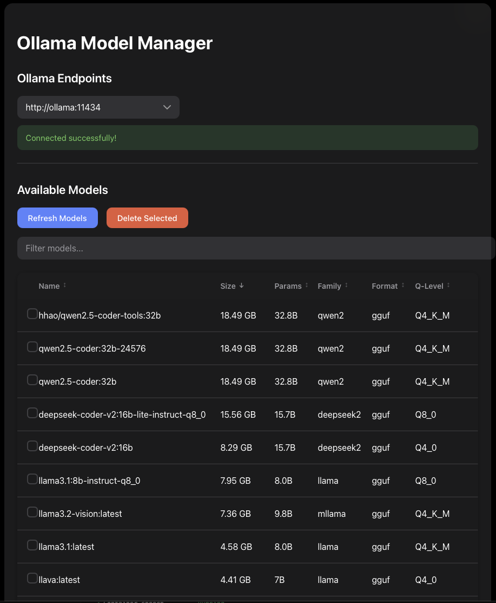

# Ollama Model Manager

A web-based management interface for Ollama endpoints, allowing you to manage and interact with multiple Ollama instances from a single dashboard.




## Features

- Connect to multiple Ollama endpoints simultaneously
- Web-based interface for model management
- Support for both local and remote Ollama instances
- Filter Models
- Sort Models
- Select Multiple Models
- Delete Selected Models

## Prerequisites

- Node.js 20.x or later (for npm installation)
- Docker and Docker Compose (for Docker installation)
- One or more running Ollama instances

## Installation

### Using npm

1. Clone the repository:
```bash
git clone https://github.com/yourusername/OllamaModelManager.git
cd OllamaModelManager
```

2. Install dependencies:
```bash
npm install
```

3. Create a `.env` file in the root directory and configure your Ollama endpoints:
```bash
OLLAMA_ENDPOINTS=http://localhost:11434,https://ollama1.remote.net,https://ollama2.remote.net
```

4. Start the application:

Development mode (with hot reload):
```bash
npm run dev
```

Production mode:
```bash
npm start
```

The application will be available at `http://localhost:3000`

### Using Docker

1. Clone the repository:
```bash
git clone https://github.com/yourusername/OllamaModelManager.git
cd OllamaModelManager
```

2. Configure your Ollama endpoints in `docker-compose.yml`:
```yaml
environment:
  - OLLAMA_ENDPOINTS=http://your-ollama-ip:11434,https://ollama1.remote.net
```

3. Build and start the container:
```bash
docker compose up -d
```

The application will be available at `http://localhost:3000`

## Configuration

### Environment Variables

- `OLLAMA_ENDPOINTS`: Comma-separated list of Ollama API endpoints (required)
  - Format: `http://host1:port,http://host2:port`
  - Example: `http://192.168.1.10:11434,https://ollama1.remote.net`

## Development

To run the application in development mode with hot reload:

```bash
npm run dev
```

